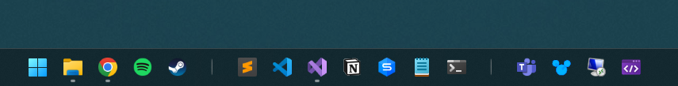

## About

Task Separator 11 allows you to add one or more splitters to the Windows 11 Taskbar. This gives you greater freedom to arrange your often used programs into groups

## Installation
Install the latest release directly from the releases tab:

[https://github.com/DrummerSi/TaskSeparator11/releases](https://github.com/DrummerSi/TaskSeparator11/releases)

## Copyright

Task Separator 11 is licenced under the MIT licence.

